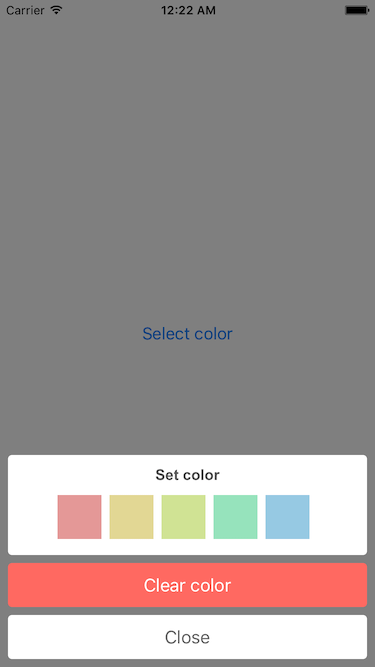

# CustomizableActionSheet


Action sheet allows including your custom views and buttons.



## Installation

### CocoaPods

```ruby
pod 'CustomizableActionSheet'
```

### Manually

Add the [CustomizableActionSheet.swift](https://github.com/beryu/CustomizableActionSheet/blob/master/Source/CustomizableActionSheet.swift) file to your project.

## Usage

```swift
var items = [CustomizableActionSheetItem]()

// Setup custom view
if let sampleView = UINib(nibName: "SampleView", bundle: nil).instantiateWithOwner(self, options: nil)[0] as? SampleView {
  let sampleViewItem = CustomizableActionSheetItem()
  sampleViewItem.type = .View
  sampleViewItem.view = sampleView
  sampleViewItem.height = 100
  items.append(sampleViewItem)
}

// Setup button
let closeItem = CustomizableActionSheetItem()
closeItem.type = .Button
closeItem.label = "Close"
closeItem.selectAction = { (actionSheet: CustomizableActionSheet) -> Void in
  actionSheet.dismiss()
}
items.append(closeItem)

// Show
let actionSheet = CustomizableActionSheet()
actionSheet.showInView(self.view, items: items)
```

NOTE: If you have installed via CocoaPods, please import `CustomizableActionSheet` like below.

```swift
import CustomizableActionSheet
```

## Requirements
* Swift2.2
* iOS 8.0
* ARC

If you want to use even iOS7.0, please to import the code directly.

## License
The MIT License (MIT)

Copyright (c) 2015 Ryuta Kibe (beryu@blk.jp)

Permission is hereby granted, free of charge, to any person obtaining a copy of this software and associated documentation files (the "Software"), to deal in the Software without restriction, including without limitation the rights to use, copy, modify, merge, publish, distribute, sublicense, and/or sell copies of the Software, and to permit persons to whom the Software is furnished to do so, subject to the following conditions:

The above copyright notice and this permission notice shall be included in all copies or substantial portions of the Software.

THE SOFTWARE IS PROVIDED "AS IS", WITHOUT WARRANTY OF ANY KIND, EXPRESS OR IMPLIED, INCLUDING BUT NOT LIMITED TO THE WARRANTIES OF MERCHANTABILITY, FITNESS FOR A PARTICULAR PURPOSE AND NONINFRINGEMENT. IN NO EVENT SHALL THE AUTHORS OR COPYRIGHT HOLDERS BE LIABLE FOR ANY CLAIM, DAMAGES OR OTHER LIABILITY, WHETHER IN AN ACTION OF CONTRACT, TORT OR OTHERWISE, ARISING FROM, OUT OF OR IN CONNECTION WITH THE SOFTWARE OR THE USE OR OTHER DEALINGS IN THE SOFTWARE.
